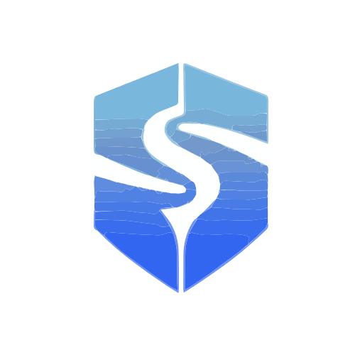

<h1 align="center">
  <picture>
    <source media="(prefers-color-scheme: dark)" srcset="ui/src/assets/flask_white.svg">
    
  </picture>
  <br />
  SecYourFlow
</h1>

<p align="center"><b>An automated incident response platform to streamline alert handling and investigation workflows.</b></p>

---

## 🔐 Key Features

### 🎫 Ticket (Alert & Incident) Management

Tickets are central to SecYourFlow, representing any event you want to handle — alerts, incidents, threat hunts, etc.
<p align="center">
  <a href="/docs/screenshots/ticket.png">
    
  </a>
</p>

---

### ✅ Tasks

Tasks are the smallest unit of work. They can be assigned, tracked, and used to document investigation progress.
<p align="center">
  <a href="/docs/screenshots/tasks.png">
    
  </a>
</p>

---

### ⚡ Reactions (Automation)

Reactions automate workflows by combining **triggers** (e.g., HTTP/Webhook, Collection Hooks) with **actions** (e.g., Python or HTTP/Webhook calls).
<p align="center">
  <a href="/docs/screenshots/reactions.png">
    
  </a>
</p>
---

### 🕒 Timelines

Timelines document every step of an investigation, including findings and results, for complete transparency.

---

### 📊 Dashboards

The dashboard displays critical system information at a glance.
<p align="center">
  <a href="/docs/screenshots/dashboard.png">
    
  </a>
</p>

---

### 🧩 Ticket Types & Templates

Use customizable templates to define additional fields like criticality, MITRE ATT\&CK, descriptions, etc.

---

### 🛠️ Custom Fields

Add custom fields to any ticket type — for example: system affected, attacker IP, malware type, etc.

---

### 🧷 Additional Features

* Ticket comments
* File attachments
* Internal linking between tickets

---

## 🧑‍💻 Tech Stack

| Category        | Technology      |
| --------------- | --------------- |
| Frontend        | Vue.js          |
| Backend         | Go (Golang)     |
| Package Manager | Bun, Go Modules |
| DevOps          | Docker          |

---

## 📦 Installation & Setup

### 🔄 Step 1: Clone the Repository

```bash
git clone https://github.com/lagzenthakuri/secyourflow
cd secyourflow
```

---

### 🌐 Step 2: Set Up the Frontend (Vue.js)

```bash
cd ui
bun install         # Install frontend dependencies
bun run dev         # Start frontend development server
```
OR
```bash
make server-ui        # Directly Start frontend development server but make sure to do make install before
```
---

### 🖙 Step 3: Set Up the Backend (Go)

Open a **new terminal window** and run the following:

```bash
cd secyourflow      # Ensure you're in the project root
make install        # Install backend Go dependencies
make fmt            # Format Go code
make dev            # Start backend development server
```

📅 **Important:** Both frontend and backend must be running simultaneously.

---

## 🛠️ Optional Commands

**Check for build errors:**

```bash
go build
```
OR 
paste this in terminal
```
export PATH=$PATH:$(go env GOPATH)/bin
```

**Run backend tests:**

```bash
make test
```

---
**Local Host**
Frontend:
```bash
http://localhost:3000/ui/
```
Admin:
```
http://127.0.0.1:8090/_/
```
---

## 🤝 Contributing

We welcome contributions! Please fork the repository and submit a pull request for improvements, bug fixes, or new features.

---

## 📄 License

This project is licensed under the [MIT License](LICENSE).

---
